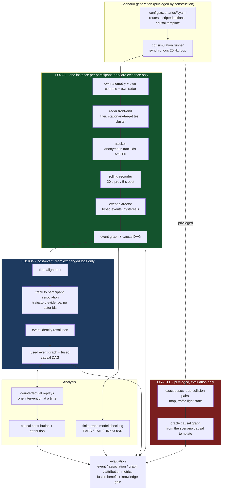

# carla-distributed-causal-forensics

Multi-vehicle forensic reconstruction in CARLA, in which **every involved vehicle
is its own ego vehicle**.

Each participant records only the evidence a real car could have recorded —
its own telemetry, its own control commands, its own radar — keeps it in a
rolling event-data-recorder buffer, and builds its **own** event graph and
**own** causal DAG from that alone. Only afterwards are the independent local
reconstructions fused into a single multi-vehicle causal DAG. A separate
privileged **oracle** layer holds simulator ground truth and is used *only* to
score the result.

CARLA itself advances on one simulator clock, but each virtual vehicle exports
evidence through an independently perturbed local recorder clock. The shared
simulator time is withheld from fusion. Radar-based joint identity/time fitting
and a global clock graph establish a common recorder timeline before final
association and graph merging. Unobservable alignment is reported explicitly,
not replaced by zero offset. See [GRAPH_FUSION.md](docs/GRAPH_FUSION.md).

The question the project is built to answer:

> Can incomplete vehicle-local observations be fused to reconstruct the causal
> structure of a multi-vehicle road incident, and identify which vehicle actions
> causally contributed to the outcome, **without using privileged simulator
> ground truth during inference**?

The system reports **causal contribution**, **contributing actions**, a
**causal initiator** where one exists, **shared causal contribution** where
several actions each suffice, and **insufficient evidence** where the onboard
evidence cannot decide. It does **not** determine legal liability, and it makes
no claim to formally verify the simulator.

## Architecture



## The data boundary

This separation is the scientific claim of the project, so it is enforced
structurally rather than by convention. See [docs/DATA_BOUNDARY.md](docs/DATA_BOUNDARY.md).

| Layer | May use | May never use |
|---|---|---|
| **Local** (`cdf.local`) | own pose/velocity/acceleration/yaw-rate, own throttle/brake/steer, own radar returns, own collision-sensor trigger | any other actor's id, pose or velocity; any camera; map, lane, road or junction data; traffic-light state; scenario labels |
| **Fusion** (`cdf.fusion`) | the local logs and graphs participants exported, their own shared trajectories, timestamps, provenance, confidence | CARLA actor ids; map data; traffic-light state; oracle labels |
| **Oracle** (`cdf.oracle`) | everything the simulator knows | — (its output must never re-enter inference) |

How it is enforced:

* **Records have no field for privileged data.** A local telemetry or track
  record simply cannot carry another actor's identity.
* **Collision identity is split at the sensor.** `CollisionSensor.drain_local()`
  returns that an impact happened, when, and how hard. The other party's
  identity is available only through `drain_privileged()`, which only the oracle
  calls.
* **Every graph carries its scope.** `load_graph(path, expect_scope=LOCAL)`
  raises if handed an oracle graph, so a mis-wired path fails loudly.
* **Track identity is anonymous.** `A::T001` records only that participant A's
  tracker opened its first hypothesis. Cross-vehicle identity is established by
  fusion, from trajectory evidence.
* **`tests/test_no_privileged_leakage.py`** parses every module under
  `cdf.local`, `cdf.fusion`, `cdf.graph` and `cdf.checking` with `ast` and fails
  on an import of `carla`, `cdf.oracle` or `cdf.simulation` (including relative
  imports), on calls such as `get_actors`/`get_map`/`get_waypoint`, and on any
  camera blueprint anywhere in the tree. It then walks every persisted local and
  fused artifact and fails on any forbidden field name at any nesting depth —
  and asserts the oracle subtree *does* contain them, so the scan cannot pass
  vacuously.

## Installation

```bash
conda env create -f environment.yml
conda activate cdf
pip install -e .
```

Install the CARLA API from your simulator distribution (the wheel must match the
server build — CARLA 0.9.15 ships cp37/cp38 wheels only, which is why this
project targets Python 3.8):

```bash
pip install "<CARLA>/PythonAPI/carla/dist/carla-0.9.15-cp38-cp38-win_amd64.whl"
```

Check everything:

```bash
python scripts/check_environment.py
```

## CARLA startup assumptions

The simulator is expected at `$CARLA_ROOT` (or a conventional location) and is
launched offscreen:

```bash
CarlaUE4.exe -carla-server -quality-level=Low -RenderOffScreen -nosound
```

`python scripts/check_environment.py --start-server` will start one for you.

Map handling is deliberately defensive, because this build is fragile about it:
reloading the map already running crashes the server, and a second switch in one
process is unreliable, so `SimulatorSession` switches once and restarts the
process if another map is needed. **S09 is configured for Town03_Opt**, the
stable optimized variant of the Town03 map in the tested build.
Details and measurements in
[docs/ENVIRONMENT.md](docs/ENVIRONMENT.md).

## Quick start — one scenario

```bash
python scripts/run_scenario.py --scenario S01 --seed 0 --variant crash
```

That records the run and then, by default, runs local analysis, fusion, the
oracle graph build, model checking and the viewer bundle. It exits non-zero if
scenario validation fails.

### Watching scenarios live

Use CARLA's native spectator to observe a run while it executes:

```powershell
python scripts/run_scenario.py --scenario S01 --variant crash --seed 0 --live --realtime
```

```powershell
python scripts/run_scenario.py --scenario S07 --variant occluded --seed 0 --live --realtime
```

```powershell
python scripts/run_scenario.py --scenario S02 --variant crash --seed 0 --live --realtime --spectator follow --follow-vehicle A
```

The CARLA spectator is visualization-only and is never used by local forensic
inference, graph fusion, or evaluation. `--playback-speed 0.5` and `2.0` select
slow motion and 2x playback respectively; both require `--realtime`.

## Full experiment suite

```bash
python scripts/run_suite.py --all --seeds 0 1 2 --continue-on-error
```

Runs are grouped by map so the simulator switches as rarely as possible. Seed 0
is the nominal specification; higher seeds apply a small, reproducible
perturbation of approach speeds and action timings (`cdf.simulation.variation`)
— because these scenarios are deterministic, so repeating them under a different
seed alone would reproduce the same trace and measure nothing.

Then:

```bash
python scripts/run_counterfactuals.py --run artifacts/S01_rear_end/seed_000_crash
python scripts/evaluate.py            --run artifacts/S01_rear_end/seed_000_crash
python scripts/generate_report.py     --artifacts artifacts
```

For several runs at once, use the campaign driver rather than a shell loop:

```bash
python scripts/run_counterfactual_campaign.py     --run artifacts/S01_rear_end/seed_000_crash     --run artifacts/S06_chain_collision/seed_000_b_rear_first     --max-interventions 4 --attempts 4 --report artifacts/summary/counterfactual_campaign.json
```

It runs each suite as a subprocess and retries it, because on the tested build
the native CARLA client aborts the whole interpreter part-way through a suite
(`docs/ENVIRONMENT.md`, finding 10). It also kills orphaned engine processes
between attempts, which is required for correctness and not tidiness: an
orphaned engine holds the RPC port, and the next "fresh" server would silently
reconnect to it.

The equivalent package CLI is `cdf run`, `cdf suite`, `cdf counterfactuals`,
`cdf evaluate`, `cdf report`, `cdf viewer`, `cdf analyse`, `cdf fuse`.

## Viewer

```bash
python scripts/serve_viewer.py --run artifacts/S01_rear_end/seed_000_crash
```

A static, dependency-free page bound to `127.0.0.1`. **There is no camera
panel** — this project has no camera; the scene is reconstructed from telemetry,
radar tracks and fused trajectories only.

It offers a 2D bird's-eye reconstruction with a timeline, signal plots, the event
timeline, the causal-graph panel, model-checking verdicts with their
counterexample intervals, and the causal-contribution summary. The perspective
selector switches between each participant, the fused reconstruction and the
oracle; every view is badged **LOCAL RECONSTRUCTION**, **FUSED RECONSTRUCTION**
or **PRIVILEGED GROUND TRUTH — EVALUATION ONLY**. A local view draws only that
participant's own telemetry and its own radar tracks. Where a reconstructed
identity is uncertain it is shown as uncertain, and where attribution cannot be
decided the panel reads **INSUFFICIENT EVIDENCE**.

## Output layout

```
artifacts/S01_rear_end/seed_000_crash/
  manifest.json  scenario_validation.json  evidence_manifest.json
  vehicle_A/   telemetry.jsonl.gz controls.jsonl.gz radar.jsonl.gz tracks.jsonl.gz
               triggers.json events.json
               event_graph.json|.graphml causal_graph.json|.graphml
  vehicle_B/   ...
  fusion/      association_report.json fused_events.json
               fused_event_graph.json|.graphml fused_causal_graph.json|.graphml
               fusion_diagnostics.json
  oracle/      oracle_trace.jsonl.gz oracle_summary.json oracle_events.json
               oracle_event_graph.json oracle_causal_graph.json|.graphml
  checking/    model_check_results.json counterexamples.json
  counterfactual/ counterfactual_manifest.json intervention_results.csv
                  causal_contribution.json
  evaluation/  metrics.json event_matches.csv edge_matches.csv attribution_metrics.json
  figures/     *.png
  viewer/      run_data.json
```

Aggregates land in `artifacts/summary/`. Generated artifacts are gitignored;
regenerate them with the commands above.

## Tests

```bash
make test           # everything (CARLA tests skip when no server is reachable)
make test-fast      # excludes CARLA-marked and slow tests; the edit/run loop
make leakage        # the data-boundary suite only
```

Unit tests cover the ring buffer, radar geometry, tracking, event hysteresis,
graph invariants, fusion, model checking and metrics. Integration tests drive
the **real** pipeline end to end on synthetic runs that need no simulator.

Two tests are marked `slow` because they scan every artifact of every recorded
run for privileged keys and oracle-only event types -- about 95 s, and the
strongest statement this project makes about its data boundary. They run in
`make test` and are excluded from `make test-fast`.

## Reproducibility

Every run records its scenario, variant, seed, complete resolved configuration
and configuration hash, map, time step, git commit, package version, and Python
and CARLA versions. `evidence_manifest.json` carries a SHA-256 digest of every
artifact file, and `python scripts/verify_evidence.py --artifacts artifacts`
re-hashes a run directory and reports anything missing or altered. Simulation is synchronous at a fixed 20 Hz with seeded
randomness throughout; safety-critical timing comes from scripted controllers,
never from the Traffic Manager.

Recorder clocks use seeded configurable experimental perturbations (default
offset up to 0.4 s, drift up to 100 ppm, optional jitter disabled). These are not
measured real-world clock specifications. Existing campaign artifacts remain a
synchronized-clock baseline; new independent-clock results must be generated
separately before making claims about the new protocol. Smoke runs can be isolated:

```powershell
python scripts/run_scenario.py --scenario S01 --seed 0 --artifacts artifacts/independent_clock_smoke
python scripts/run_clock_ablation.py --run-dir <printed-run-directory>
```

The evaluation-only A/B/C driver compares oracle-restamped synchronized timing,
deliberately uncorrected independent timing, and the normal evidence-aligned path
on the same physical recording. It writes only under `evaluation/` and cannot
enable an uncorrected normal fusion mode. See
[EXPERIMENT_PROTOCOL.md](docs/EXPERIMENT_PROTOCOL.md).

## Documentation

| Document | Contents |
|---|---|
| [ARCHITECTURE.md](docs/ARCHITECTURE.md) | the pipeline module by module, with the real call chain |
| [DATA_BOUNDARY.md](docs/DATA_BOUNDARY.md) | allowed/forbidden inputs per layer and how they are enforced |
| [EVENT_TAXONOMY.md](docs/EVENT_TAXONOMY.md) | every event type, its signal, thresholds and hysteresis |
| [CAUSAL_MODEL.md](docs/CAUSAL_MODEL.md) | event graph vs causal DAG, the rule table, interventional semantics |
| [GRAPH_FUSION.md](docs/GRAPH_FUSION.md) | association cost function, merging, provenance, knowledge gain |
| [MODEL_CHECKING.md](docs/MODEL_CHECKING.md) | properties, finite-trace semantics, why UNKNOWN is first class |
| [SCENARIOS.md](docs/SCENARIOS.md) | S01–S09: map, participants, intent, expected outcome, interventions |
| [EXPERIMENT_PROTOCOL.md](docs/EXPERIMENT_PROTOCOL.md) | seeds, variants, metrics, radar calibration procedure |
| [ENVIRONMENT.md](docs/ENVIRONMENT.md) | tested versions and measured simulator behaviour |
| [EXPERIMENTAL_FINDINGS.md](docs/EXPERIMENTAL_FINDINGS.md) | results, generated from actual runs |
| [LIMITATIONS.md](docs/LIMITATIONS.md) | what this does not show |
| [REFERENCES.md](docs/REFERENCES.md) | the supplied reading list and why each entry mattered |

## Limitations

Simulated radar, scripted scenarios, at most three vehicles, no camera, no local
semantic map, and causal claims that hold only under the stated intervention
semantics. See [docs/LIMITATIONS.md](docs/LIMITATIONS.md) — reading it before the
results is recommended.

## Attribution

The idea originates from the read-only reference project
[svs-forensic-viewer](https://github.com/DilaverShtini/svs-forensic-viewer),
MIT licensed, Copyright (c) 2026 Marco Costantini, Chiara Giangiulli, Dilaver
Shtini. That project's CARLA startup, radar attachment, telemetry logging,
collision triggering and forensic-viewer layout informed the design here. The
implementation in this repository is written independently; the MIT attribution
is preserved in [LICENSE](LICENSE).

## License

MIT. See [LICENSE](LICENSE).
