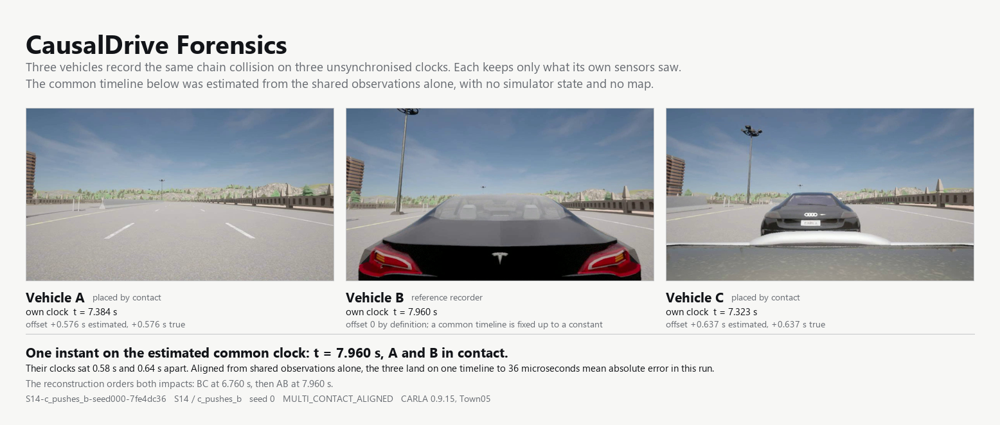

# CausalDrive Forensics

Distributed reconstruction and causal analysis of road incidents from
independent vehicle logs in CARLA.



## What is it?

After a collision there is no single record of what happened. There are several
vehicles, each holding a short buffer of its own sensor data: telemetry,
controls, radar returns to anonymous tracks, a front camera, a lane sensor and a
contact trigger. No vehicle sees another vehicle's data, and each runs on its own
clock, offset from the others by a fraction of a second it does not know.

Afterwards those logs are brought together. The system estimates the offsets
between the clocks from evidence the vehicles themselves recorded, matches each
anonymous radar track to the participant it really was, and merges everything
into one timeline. From that timeline it reconstructs the incident, builds a
physical causal graph of what led to what, checks temporal properties over the
trace, and runs a separate responsibility layer that asks which obligations were
violated and whether a violation lies on a physical causal path. Counterfactual
replays then test whether changing an action would have prevented the outcome.

CARLA's privileged state, the true positions, the true clocks, the map and the
actor identities, is used only afterwards, to grade the answers. It is never
available to the reconstruction. The output is a causal account, not a finding of
legal fault, and no number here is a share of one.

## How it works

```
Vehicle A log ─┐
Vehicle B log ─┼→  time alignment  →  identity association  →  global log
Vehicle C log ─┘                                                    │
                                                                    ▼
                                                       physical causal DAG
                                                                    │
                                                                    ▼
                                                     temporal properties
                                                                    │
                                                                    ▼
                                                         responsibility
                                                                    │
                                                                    ▼
                                                   counterfactual replay
```

Details in [Architecture](docs/ARCHITECTURE.md).

## What each vehicle records

| Input | What it gives |
|---|---|
| telemetry | its own position, velocity, acceleration, yaw and yaw rate |
| controls | its own throttle, brake, steer, handbrake, gear |
| radar | range, bearing and range rate to anonymous local tracks |
| RGB camera | video around the event, for signs and road markings |
| lane sensor | that a road marking was crossed, and what sort |
| contact trigger | that an impact happened, when, and how hard, never who with |
| local clock | its own offset and jitter, shared with nobody |

What a vehicle may not see is stated and enforced in
[Data boundary](docs/DATA_BOUNDARY.md).

## Benchmark

**16 scenarios, 35 variants, 105 final CARLA runs, 3 seeds.**

| Scenarios | What they cover |
|---|---|
| S01 to S09 | the original reconstruction benchmark: rear-end, cut-in, crossing, chain collision, partial view, roundabout. Hash-frozen, so a better metric must come from the method |
| S10 to S12 | STOP signs and priority: one approach controlled, the mirror case, and an all-way stop |
| S13 | disputed lane change, where the deciding evidence is split across two vehicles |
| S14 to S16 | multi-impact and secondary collisions: the pushed vehicle, the pile-up with a bystander, and the second impact that may be a consequence or its own doing |

Full descriptions in [Scenarios](docs/SCENARIOS.md).

## Main results

All figures are from the final V2 campaign and are regenerated from the
artifacts, never transcribed by hand.

| Result | Measured | Read it with |
|---|---|---|
| Campaign completed | 105 of 105 runs recorded and evaluated, 0 exceptions | scenario validation passed on 83 of 105; the 22 failures are all in the new S10 to S16 set and are listed, not hidden |
| Collision pairs | recall 0.994 | 42 spurious collisions across the campaign, so precision is the weak side |
| Collision timing | 0.0043 s mean error, 0.0211 m mean location error | on the estimated common clock, not on simulator time |
| Clock offset | 0.0037 s mean absolute error over 238 scored recorders | worst single recorder 0.2497 s; 14 of 252 stayed unresolved and are reported as such |
| Radar fallback, S07 | all 6 runs aligned; the vehicle that never collides is placed by radar to 0.0021 s mean, 0.0032 s worst | contact is used first; radar only reaches vehicles contact cannot |
| STOP sign detection | recall 90.2 percent | precision 55.4 percent, so the detector reports more signs than are there |
| Multi-impact ordering | an order was claimed on 12 of 14 multi-impact runs and was right on all 12 | on the other 2 the method declined, because the offset rested on an anchor doing double duty; declining is its own verdict, not a wrong answer |
| Responsibility | physical contributor F1 0.657 | normative contributor F1 0.487, recall 0.396: naming who violated an obligation is much harder than naming who was involved |

Drift is deliberately not estimated; scale is fixed to 1. There is no verified
stop-line ground truth in Town05, so stop-line detections are reported and not
scored.

Full tables, case studies and negative results in [Results](docs/RESULTS.md).

## Explore

| | |
|---|---|
| [Overview](docs/OVERVIEW.md) | the longer version of this page: what makes the problem hard, and what is claimed |
| [Architecture](docs/ARCHITECTURE.md) | how the pieces fit together |
| [Events](docs/EVENTS.md) | the event vocabulary, and what may be compared |
| [Time synchronization](docs/CLOCKS.md) | contact first, radar second, unresolved last |
| [Scenarios](docs/SCENARIOS.md) | what each scenario is for |
| [Formal methods](docs/FORMAL_METHODS.md) | temporal properties, and why UNKNOWN is a verdict |
| [Responsibility](docs/RESPONSIBILITY.md) | obligations, violations, contribution |
| [Counterfactuals](docs/COUNTERFACTUALS.md) | replay, but-for causation, prevention |
| [Results](docs/RESULTS.md) | the final V2 campaign in full |
| [Limitations](docs/LIMITATIONS.md) | what this does not establish |
| [Viewer](docs/VIEWER.md) | the four sections: reconstruction, graph, responsibility, video |
| [Reproducibility](docs/REPRODUCIBILITY.md) | running it again and getting the same answer |
| [Data boundary](docs/DATA_BOUNDARY.md) | what inference may not see, and how that is enforced |
| [What changed from V1](docs/V2_REFACTOR_AUDIT.md) | the refactor, and what was deliberately not changed |
| [References](docs/REFERENCES.md) | the reading behind the design choices |

Earlier V1 material is kept under [`legacy/`](legacy/README.md). V1 and V2
recordings are never mixed: V2 changed the sensors and the timing semantics, so a
figure averaged over both would describe neither.

## Quick start

Start CARLA yourself. The project connects to a running simulator and does not
launch one:

```bash
python -m cdf.cli env
```

Run one scenario end to end, recording and then analysing it:

```bash
python scripts/run_scenario.py --scenario S10 --variant rolls_through --seed 0 --artifacts artifacts_v2
```

Open the viewer on that run:

```bash
python scripts/serve_viewer.py --run artifacts_v2/S10_single_stop_a/seed_000_rolls_through
```

The full campaign and every other command are in
[Reproducibility](docs/REPRODUCIBILITY.md).

## Licence

See [LICENSE](LICENSE).
