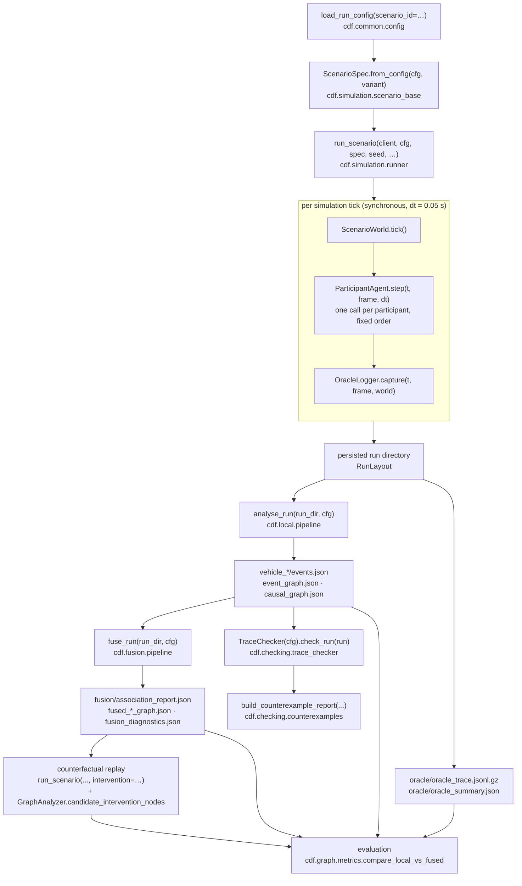
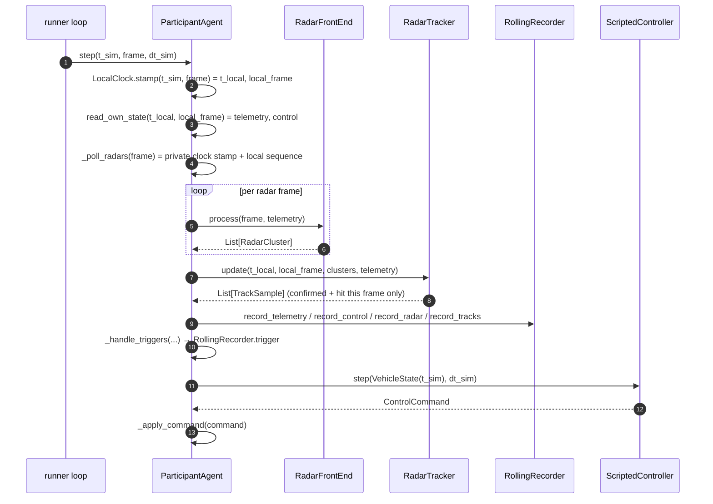

# Architecture

## The pipeline in ten stages

```
        ┌── Vehicle A ──┐
        │   Vehicle B   │   1. local acquisition
        └── Vehicle C ──┘      telemetry, controls, radar, camera, lane, contact
                │
                ▼              2. local event extraction
        per-vehicle events        one log per vehicle, on its own clock
                │
                ▼              3. time synchronization
          common timeline         contact, then radar, then unresolved
                │
                ▼              4. vehicle identity association
        tracks become names       anonymous radar track to participant
                │
                ▼              5. global event log
            one account           every vehicle's events on one axis
                │
                ▼              6. physical causal DAG
           what led to what       hypotheses with evidence and confidence
                │
      ┌─────────┼─────────┐
      ▼         ▼         ▼
  7. temporal  8. respon-  9. counterfactual
     properties   sibility     replay
   PASS/FAIL/    violation   would it have
    UNKNOWN      on a path    been avoided
      └─────────┼─────────┘
                ▼
                              10. oracle and evaluation
                                  scored against the privileged record
```

**1. Local acquisition.** Each vehicle records only what its own sensors give
it: telemetry, controls, radar returns to anonymous tracks, forward camera, lane
sensor, contact trigger, on its own clock. Nothing about another vehicle, and
nothing about the map.

**2. Local event extraction.** Those recordings become typed events. A brake
onset from its own controls, a closing range from its own radar, a STOP sign
from its own frames. Each vehicle also builds its own event graph and its own
causal graph, from its own evidence alone.

**3. Time synchronization.** The logs are on different clocks, so before they can
be merged the offsets have to be estimated from evidence the vehicles recorded:
a shared impact first, a radar trajectory fit second, unresolved last.
[CLOCKS.md](CLOCKS.md).

**4. Vehicle identity association.** One vehicle's radar track `B::T001` and the
participant C are the same thing, and nothing in the recordings says so. The
association is inferred from trajectory agreement on the common timeline, which
is why it cannot run before stage 3.

**5. Global event log.** A flat, timestamped, checkable table of everything every
vehicle recorded, on one axis, before any graph is built. A reader can audit this;
a DAG is harder to argue with.

**6. Physical causal DAG.** What led to what, as hypotheses carrying evidence and
confidence, with cycles rejected. Physical only: it says nothing about rules.
[EVENTS.md](EVENTS.md) separates these relations from the event-graph ones.

**7. Temporal properties.** Metric temporal logic over the merged trace, three
valued. PASS, FAIL, or UNKNOWN where the recording does not settle it.
[FORMAL_METHODS.md](FORMAL_METHODS.md).

**8. Responsibility graph.** A second graph built from the first, asking whether
a normative violation lies on a physical causal path. Kept separate so the
physics can be accepted while the rule is disputed.
[RESPONSIBILITY.md](RESPONSIBILITY.md).

**9. Counterfactual replay.** The encounter is re-run with one or more selected
actions or non-actions changed, to test whether the outcome depended on them.
Single changes are tried first; bounded combinations follow only where no single
change prevented the outcome.
[COUNTERFACTUALS.md](COUNTERFACTUALS.md).

**10. Oracle and evaluation.** Only now is the privileged record opened, to score
what the previous nine stages produced. Nothing it contains reaches them.
[DATA_BOUNDARY.md](DATA_BOUNDARY.md) states the boundary and the tests that
enforce it.

The rest of this document traces the same pipeline module by module, naming the
actual functions that run. Every symbol below exists in the repository; paths are
relative to the repository root.

Terminology used throughout the docs: *causal contribution*, *causal initiator*,
*contributing action*, *reconstructed cause*, *safety-property violation*,
*shared causal contribution*, *insufficient evidence*.

---

## 1. The stage map, in detail



Every stage in this map has a driver that runs. The counterfactual sweep is
`cdf.causal.counterfactuals.run_counterfactual_suite`, driven by
`scripts/run_counterfactuals.py`; evaluation is `cdf.evaluation.suite.evaluate_run`,
driven by `scripts/evaluate.py`. Sections 7 and 8 name the building blocks.

---

## 2. Configuration and scenario construction

`cdf.common.config.load_run_config(scenario_id, sensor_profile, overrides,
config_root)` deep-merges, in order:

1. `configs/default.yaml`, the threshold registry;
2. `configs/sensors/<profile>.yaml`, the radar profile (`radar` block only);
   the profile is the explicit argument, else the scenario's `sensors.profile`,
   else the default's, else `radar_baseline`;
3. `configs/scenarios/<id>.yaml`, located case-insensitively by
   `find_scenario_file()` from `"S01"`, `"s1"` or `"S01_rear_end"`;
4. `dotted.key=value` overrides parsed by `parse_override()`.

The merged mapping becomes a `Config`. `Config.hash` is `config_hash()`, a
16-hex prefix of the SHA-256 of the normalised (float-rounded, key-sorted) JSON.
`Config.get("a.b.c", default)` is the only read path used in the pipeline;
`Config.require()` raises for values with no sensible default.

`ScenarioSpec.from_config(cfg, variant)` reads the `scenario` block, deep-merges
the chosen variant over it, applies `participant_overrides` per participant id,
builds `ParticipantSpec` / `SpawnSpec` / `RouteSpec` / `ScriptedAction` objects,
and runs `ScenarioSpec.validate_static()`, which enforces 2 or 3 participants,
unique participant and action ids, known `expected_outcome`, and that every
`intervention_candidates` entry names a declared action. Any problem raises.

---

## 3. `run_scenario`, one scenario execution

`cdf.simulation.runner.run_scenario(client, cfg, spec, seed, artifacts_root,
persist, intervention, layout) -> RunResult`

**Setup**

1. `import_carla()`, lazy import with an actionable error.
2. `make_run_id(scenario_id, seed, variant, config_hash)` →
   `"S01-crash-seed000-0b81b521"`. With an `intervention` the spec is first
   rewritten by `_apply_intervention()` and `-cf-<intervention_id>` is appended.
3. `RunLayout.create(artifacts_root, scenario_id, name, seed, variant)`.
4. `environment_block()` (`cdf.common.io`) and an `OracleLogger`.
5. `with ScenarioWorld(client, cfg, spec.map_name, seed=seed) as sworld:`,
   `__enter__` calls `ensure_map()`, applies synchronous mode /
   `fixed_delta_seconds` / substepping, and seeds the Traffic Manager.
6. `oracle.bind_map(sworld.map)`; `sworld.spawn_points()`.

**Placement, before anything is spawned**

7. Per participant: `resolve_spawn_waypoint(sworld.map, spawn_points,
   pspec.spawn)` (anchor `spawn_index`, `location` or `junction_approach` via
   `junction_approach_waypoint()`), then `build_route(sworld.map, wp,
   pspec.route)` which samples the route forward and resolves each junction with
   `_choose_successor()` by relative heading.
8. The spawn `carla.Transform` is built from the waypoint with
   `simulation.spawn_z_offset` added and pitch/roll forced to zero.
9. `_assert_spawn_separation(placements, min_gap_m=cfg.get("simulation.min_spawn_gap_m", 5.0))`
   fails *before* any actor exists.

**Instantiation**

10. `make_controller(pspec, route)` → `ScriptedController`.
11. `ParticipantAgent(...)`; `agent.spawn()` attaches the radars
    (`radar_specs_from_config`) and the `CollisionSensor`.
12. `oracle.register(pid, agent.vehicle, collision_sensor=..., controller=...)`
    (the privileged side of the collision sensor and the actor id).

**Settling**

13. `sworld.warmup()`, `simulation.warmup_ticks` (20) discarded ticks.
14. `agent.apply_initial_speed()` per participant, then four more ticks so the
    imparted velocity takes effect in the solver.
15. `t0 = sworld.elapsed_seconds`; `oracle.time_offset = t0`;
    `agent.time_offset = t0`; `agent.drain_radar_queues(sworld.frame)` discards
    warm-up radar output. Hidden physics/controller time is scenario-relative
    from here; exported participant timestamps pass through `LocalClock`.

**Main loop**

```
while True:
    snapshot = sworld.tick()
    t = snapshot.timestamp.elapsed_seconds - t0
    for agent in agents: agent.step(t, frame, dt)      # fixed order
    oracle.capture(t, frame, world=sworld.world)
    last = _latest_trigger_time(agents)
    if last is not None and t >= last + recorder.post_event_s: break
    if t >= min(spec.max_duration_s, simulation.max_duration_s): break
```

Termination is anchored to the **latest** trigger, not the first: an early
near-miss trigger must not end the run before the collision it anticipated.

**Finalisation**

16. `agent.finalize()` stops the sensors and returns the retained window.
17. Outcome: `COLLISION` if `oracle.collision_pairs()` is non-empty, else
    `NEAR_MISS` if any recorder triggered, else `NO_EVENT`.
18. `validate_run(spec, oracle, agents, cfg)`, section 3.1.
19. When persisting: `agent.persist(layout)` per participant,
    `oracle.persist(layout)`, `write_json(layout.manifest, manifest)`,
    `write_json(layout.scenario_validation, validation)`.

Clock profiles are persisted only in `oracle/clock_ground_truth.json`.
`LocalClock` derives a private seeded stream from a SHA-256 digest of scenario
context, seed, participant and clock configuration. It applies
`t_local = (1 + drift_ppm*1e-6)*t_sim + offset + jitter`, caches one stamp per
tick for all local streams, and clamps optional jitter to preserve monotonicity.
Each recorder exports its own unrelated frame-sequence origin, not CARLA frames.
Controller actions, physics stepping and run termination still use hidden `t_sim`.

### 3.1 `validate_run`

Checks that the run produced the encounter the scenario declared, and returns
`{"passed": bool, "problems": [...], "checks": {...}}`:

* participant count matches, and is at most three;
* `expected_outcome`: a collision must have occurred, every
  `expected_collision_pairs` entry must appear, and any
  `expected_collision_order` must match the observed order; a `near_miss` must
  have triggered without a collision; `no_event` must have no collision;
* `validation.min_separation_below_m` for `validation.encounter_pair`, measured
  with the privileged `OracleLogger.min_separation()`;
* sensor health: a participant with zero radar frames, or with more than 25 % of
  frames missed, is a problem;
* a participant whose privileged maximum speed stays below 0.5 m/s never moved.

The problems are appended to `RunManifest.notes`, so a silently degenerate
scenario cannot quietly poison downstream metrics.

---

## 4. `ParticipantAgent.step`, the onboard stack

`cdf.simulation.vehicle_agent.ParticipantAgent` is the narrow waist between the
simulator and local inference: if a privileged quantity ever reached local
inference it would have to pass through this one file.



**`read_own_state`** touches `self.vehicle` only: transform, velocity,
acceleration, angular velocity, control. It calls
`cdf.local.own_state.make_telemetry()`, which fills `speed` via `ground_speed()`
and `accel_long`/`accel_lat` via `body_frame_acceleration()`, so every producer
of telemetry agrees on the definitions.

**`RadarFrontEnd.process(frame, telemetry)`** (`cdf.local.radar`) refuses a frame
or telemetry belonging to another participant, then:

1. `apply_degradation(frame, cfg, rng)`, the sensor-quality profile is applied
   *after* acquisition, from a seeded stream, so a degraded run is reproducible.
   One uniform and three Gaussian draws are consumed per detection whether or not
   it survives, so changing a noise sigma re-weights the outcome without
   reshuffling the stream.
2. `filter_detections(detections, cfg)`, the five `radar_processing.filter`
   gates (range band, `max_abs_velocity_mps`, altitude band, `max_abs_azimuth_rad`).
3. `polar_to_body(...)` per surviving return, plus
   `stationarity_residual(velocity, azimuth + sensor_yaw, own_speed)`.
4. `cluster_points(points, eps_m, min_points, velocity_weight)`, a hand-written,
   index-order-deterministic DBSCAN over `(rel_x, rel_y, range_rate)`.
5. `_build_cluster(...)` per group: centroid, mean range rate, `body_to_global`,
   extent, `_quality(n_points, spread)`, and the **median** member stationarity
   residual compared against `radar_processing.stationary.tolerance_mps`.
6. Clusters sorted by range and capped at `radar_processing.cluster.max_clusters`.

**`RadarTracker.update(t, frame, clusters, telemetry)`** (`cdf.local.tracking`)
refuses foreign clusters/telemetry and a backwards `t`, then:

1. `_predict(t)`, constant-velocity prediction of every track to `t`, each from
   its own `last_t`, so a coasting track is extrapolated over the whole gap.
2. `_associate(predictions, clusters)`, a gated **optimal** one-to-one
   assignment (`scipy.optimize.linear_sum_assignment`) on global-frame distance;
   pairs beyond `tracking.gate_m` are priced at `_GATE_REJECT_COST` before the
   solve and dropped after it.
3. `_apply_hit` (alpha-beta correction with `position_alpha` / `velocity_alpha`,
   confidence `+ hit_gain`, latching confirmation at `min_hits_to_confirm` and
   `confidence.min_confirm`) or `_apply_miss` (coast, confidence `- miss_decay`).
4. Tracks with `misses >= max_misses` are dropped.
5. Unassociated clusters `_spawn` a new track, **unless** the cluster is
   world-fixed and `radar_processing.stationary.reject_new_tracks` is set. The
   test gates track *birth* only, so a tracked vehicle that brakes to a halt is
   never lost.
6. `_enforce_capacity()` keeps at most `tracking.max_tracks`, dropping the least
   confident, ties broken by creation order.
7. Returns one `TrackSample` per **confirmed** track that was **hit this frame**.
   Coasting tracks emit nothing: a sample is a claim that the object was observed.

**`RollingRecorder`** (`cdf.local.recorder`) is the EDR analogue. Each stream has
a `RingBuffer` with a hard `deque(maxlen=...)` capacity of
`pre_event_s * sample_rate_hz * records_per_step` (the multiplicity is read from
the same config keys the producers use, so a 16-track step still retains a full
20 s of track history) plus a post-event list that *refuses* records past its
capacity rather than evicting, after an impact the earliest post-event records
are the valuable ones. The first `trigger()` freezes the window to
`[t_trigger - pre_event_s, t_trigger + post_event_s]`; later triggers are
recorded but never re-arm the window.

**`_handle_triggers`** evaluates all three triggers from onboard evidence only:

| Trigger | Source | Config |
|---|---|---|
| `COLLISION` | `CollisionSensor.drain_local(min_impulse=…)`, identity stripped | `recorder.triggers.collision.min_impulse` |
| `NEAR_MISS` | own track TTC and range, armed once | `recorder.triggers.near_miss.ttc_s`, `.min_range_m` |
| `EMERGENCY_BRAKE` | own brake command and own `accel_long`, armed once | `recorder.triggers.emergency_brake.brake_cmd`, `.decel_mps2` |

**`ScriptedController.step`** (`cdf.simulation.controllers`) is generation code:
pure-pursuit steering against a lookahead point displaced by any active
`lane_shift` offset (raised-cosine ramp), plus a `PIDLongitudinal` PI loop on the
current target speed, overridden while a `brake` or `stop` action is active. After
`notify_impact()` and with `post_impact_stop`, it commands a full stop.

---

## 5. `analyse_run`, local inference

`cdf.local.pipeline.analyse_run(run_dir, cfg, persist=True) -> Dict[str, LocalAnalysis]`

Reads **only** `vehicle_*/`; the `oracle/` subtree is never opened. Recording and
inference are separate stages on purpose: the inference chain never holds a handle
to a CARLA world, and can be re-run and re-tuned without a simulator.

For each `pid` in `layout.participant_ids()`:

1. `load_participant(layout, pid, with_radar=False)` → `ParticipantEvidence`.
2. `analyse_participant(ev, cfg, run_id, scenario_id, seed)`:
   * `EventExtractor(cfg).extract(ev)`;
   * `build_event_graph(events, ev, cfg, …)`;
   * `build_causal_graph(events, ev, cfg, …)`.
3. When persisting: rewrite `events.json` (keeping the recorder `meta` already on
   disk and adding `LocalAnalysis.summary()`), then `save_graph()` for both
   graphs, JSON plus GraphML.

**`EventExtractor.extract`** (`cdf.local.event_extractor`):

```
compute_own_indicators(ev, cfg)            # cdf.local.indicators
compute_track_indicators(ev, cfg)
_own_candidates + _track_candidates + _trigger_candidates
_merge(...)                                # debounce
_merge(merged + _derived_candidates(...))  # NEAR_MISS, POST_IMPACT_STOP
_to_event(...) per candidate               # make_event_id → stable ids
```

Threshold crossings are Schmitt-triggered episodes (`_find_episodes`,
`_release_threshold`), not instants. Full semantics: [`docs/EVENTS.md`](EVENTS.md).

**`build_event_graph`** (`cdf.local.event_graph`) emits `PRECEDES` (forward
fan-out), `OBSERVED_FROM` (radar-derived event → its track's appearance),
`SAME_TRACK` (per-track chain) and `INTERACTS_WITH` (ego event ↔ temporally
overlapping track event), then applies a global edge budget that drops the least
informative relation class first. Nodes pass `validated_local_nodes()`, which
refuses an oracle-only event type, an `ORACLE`-provenance event, or an event
belonging to another participant.

**`build_causal_graph`** (`cdf.local.causal_graph`) loads the rule table with
`load_rules(cfg)`, fires `propose_edges()` over every ordered event pair, scores
each with `confidence_terms()`, and makes the result acyclic with
`enforce_dag()`. Full semantics: `docs/CAUSAL_MODEL.md`.

---

## 6. `fuse_run`, post-event fusion

`cdf.fusion.pipeline.fuse_run(run_dir, cfg, persist=True, fuse_event_graph=True)
-> FusionResult`

```
run = load_run(layout.root, with_radar=True)         # >= 2 participants; local mounts
alignment = align_participants(run, cfg)             # joint radar identity/time fitting
run = AlignedRunEvidence(run, alignment)             # detached common-time streams
associate_tracks(run, cfg)                           # only common-time comparisons
resolve_subjects(assignments)                        # track_id → participant_id
load_graph(layout.causal_graph(pid), expect_scope=Provenance.LOCAL)   # per pid
load_graph(layout.event_graph(pid),  expect_scope=Provenance.LOCAL)
fuse_graphs(run, local_causal, assignments, cfg, graph_kind="causal")
fuse_graphs(run, local_event,  assignments, cfg, graph_kind="event")   # optional
```

`FusionResult` carries `alignment`, `assignments`, `subject_map`, `fused_causal`,
`fused_event`, `diagnostics`, `local_causal`, `local_event`.

`fuse_graphs` (`cdf.fusion.graph_fusion`) itself runs
`assert_non_oracle` → `resolve_subjects` → `align_event_records` →
`_merge_nodes` → `_merge_edges` → `infer_global_causal_edges` → `_enforce_dag` →
`_fusion_added` → `_build_diagnostics`.

`infer_global_causal_edges` (`cdf.fusion.post_fusion_causal`) is the stage that
makes fusion more than a union. Every edge a merge can produce was drawn inside
one vehicle's log, because a causal rule can only relate two events the same
recorder observed; this proposes edges *between* claims made by different
participants, which is the only way to relate "B braked" to "the gap A was
measuring closed". It runs after identities are resolved and timelines are
common, refuses to make an observation a cause, refuses to run backwards in
time beyond the clock's own admitted uncertainty, and never displaces an edge a
participant actually claimed. One key switches it off
(`fusion.post_fusion.enabled`), which is what the method ablation toggles. The acyclicity policy is **delegated** to
`cdf.local.causal_graph.enforce_dag` (via `_delegate_enforce_dag`, which inspects
the signature rather than assuming it) so a fused DAG is constrained exactly like
a local one; `_greedy_acyclic` is the fallback. Full semantics:
`docs/GRAPH_FUSION.md`.

The loader includes local radar mount calibration. It strips
simulation/scenario ground truth from the inference-facing manifest. Graphs are
converted by the aligned view before event matching; fused evidence retains
local/common times and clock confidence. Unresolved clocks do not participate in
cross-vehicle fusion; their original local graphs remain untouched.

After the graphs are fused, `cdf.graph.episodes.extract_episodes` groups each
vehicle's nodes into named behaviours, `cdf.graph.reconstruction` walks the
causal ancestry of every outcome into chains with templated narratives, and
`build_attribution_hypothesis` names the behaviours at the roots of those chains
— a hypothesis, stamped `not_validated` until a replay confirms it.

The persisted outputs are `association_report()`, `time_alignment.json`, the
diagnostics, `fused_events.json`, both fused graphs in JSON and GraphML,
`incident_reconstruction.json` and `causal_attribution.json`.

---

## 7. Oracle build and property checking

**Oracle.** `cdf.oracle.logger.OracleLogger` is the only module that reads global
simulator state. Per tick, `capture()` records an `OracleActorState` per
participant, exact pose, velocity, acceleration, controls, plus the privileged
map context (`lane_id`, `road_id`, `section_id`, `is_junction`, `junction_id`,
`traffic_light_state`, `traffic_light_id`), and every traffic light in the
world. `_drain_collisions()` pulls `CollisionSensor.drain_privileged()` and
resolves `other_actor_id` to a participant through `participant_of_actor()`;
`collision_pairs()` de-duplicates CARLA's twice-reported impacts into ordered
`(a, b, t)` triples. `persist(layout)` writes `oracle/oracle_trace.jsonl.gz`
(`frame_rows()`) and `oracle/oracle_summary.json` (`trace()`).

**Checking.** `cdf.checking.trace_checker.TraceChecker(cfg)`:

* `.check_participant(ev)` runs every `LOCAL_PROPERTIES` entry on one
  participant's own evidence;
* `.check_run(run)` aggregates that over the run into the on-disk shape of
  `checking/model_check_results.json`, and contains **no** oracle verdicts;
* `.check_oracle(oracle_trace)` runs `ORACLE_PROPERTIES` on a plain trace mapping,
  returning a separate list that the caller must persist separately.

`_evaluate()` validates every returned `PropertyResult`: right scope, right id,
non-empty `parameters`, and no `FAIL` without a violating interval. A property
that raises aborts loudly rather than degrading to `UNKNOWN`.

`cdf.checking.counterexamples.build_counterexample_report(results, run, cfg)`
extracts, for every `FAIL`, the padded trace window around the hull of its
violating intervals, decimated deterministically to
`checking.counterexample.max_samples`, with per-condition spans. Full semantics:
[`docs/FORMAL_METHODS.md`](FORMAL_METHODS.md).

---

## 8. Counterfactuals and evaluation

**Counterfactual replay** is an interventional re-execution, not a graph edit:
`run_scenario(client, cfg, spec, seed, intervention={...})` rewrites exactly one
`ScriptedAction` through `_apply_intervention()`,
`op ∈ {disable, delay, advance, scale, set}`, and holds the map, spawn state,
seed and every other controller parameter identical. Which events are worth
replaying comes from the structural half, `cdf.graph.analysis.GraphAnalyzer`:
`candidate_intervention_nodes()`, `remove_node()`, `remove_edge()`,
`minimal_outcome_subgraph()`, `causal_paths_to()`, `root_causes()`.

> **Status.** The replay driver and the contribution-score writer
> (`counterfactual/counterfactual_manifest.json`, `intervention_results.csv`,
> `causal_contribution.json`) are **not implemented**. `cdf.causal` is an empty
> placeholder package. The layout paths, the config block
> (`counterfactual.*`) and both halves above exist. See `docs/CAUSAL_MODEL.md` §6.

**Evaluation** compares the two sides. The metric implementations exist in
`cdf.graph.metrics`, `prf1`, `event_metrics`, `graph_structure_metrics`
(node/edge precision, recall, F1 and structural Hamming distance),
`compare_local_vs_fused` (per participant, the best single local reconstruction,
the fused one, and the deltas), built on the tolerance-correct Hungarian matcher
in `cdf.graph.matching`.

> **Status.** `cdf.evaluation` is an empty placeholder package: no module writes
> `evaluation/metrics.json`, `event_matches.csv`, `edge_matches.csv` or
> `attribution_metrics.json` yet. `cdf.evaluation` is the layer permitted to read
> both sides, and it must never write anything back into a local or fused artifact.

---

### 8.1 What the evaluation layer contains

| Module | Answers |
|---|---|
| `graph_metrics` | how much of the reference graph came back |
| `event_metrics`, `association_metrics` | event matching and identity resolution |
| `attribution_metrics` | the declared contributors, from the scenario's template |
| `causal_metrics` | whether the *incident* was explained: scene reconstruction, causal chains, contributor sets, restraint on the negative controls |
| `method_ablation` | best-local vs merged vs merged-plus-reasoning, over one recording, changing one key |
| `clock_ablation` | the same recording scored under three clock protocols |
| `final_results` | every reported number, derived from the artifacts rather than transcribed |
| `suite`, `tables`, `figures` | per-run scoring, campaign CSVs, per-run plots |

`cdf.causal.combinations` sits beside them on the privileged side: it is the
vocabulary a *set* of removed actions is classified in, and the bounded search
that decides which sets are worth replaying.

`cdf.common.campaign` stamps an artifacts tree with the protocol it was recorded
under, so a run recorded differently is reported as foreign rather than averaged
into a campaign it does not belong to.

## 9. Shared foundations (`cdf.common`)

| Module | Role |
|---|---|
| `schemas.py` | every persisted record type, the `EventType` taxonomy, `Provenance`, `CheckStatus`, `SCHEMA_VERSIONS`, the anti-leakage registries, `make_event_id` / `make_track_id` / `stable_digest` / `to_jsonable` |
| `layout.py` | `RunLayout`, **the** canonical artifact paths; nothing hard-codes one |
| `config.py` | layered YAML merge, `Config`, `config_hash`, `load_run_config` |
| `evidence.py` | `ParticipantEvidence` / `RunEvidence` and their loaders; the single place the artifact format is interpreted |
| `geometry.py` | frame transforms (`polar_to_body`, `body_to_global`, `global_to_body`, `radar_detection_to_global`), `time_to_collision_1d`, `closest_approach`, `polyline_intersection`, `predict_constant_velocity`, `resample_trajectory`, `trajectory_rmse` |
| `timeline.py` | `Interval`, `TimeGrid`, `temporal_relation`, `estimate_clock_offset`, `resolve_offsets`, `build_common_grid` |
| `io.py` | atomic, deterministic `write_json` / `write_jsonl_gz` / `write_csv`, `sha256_file`, `write_evidence_manifest` / `verify_evidence_manifest`, `environment_block` |

`cdf.graph` sits alongside: `export.py` (the single NetworkX bridge plus
`load_graph(expect_scope=…)`), `matching.py` (canonical identity and optimal
matching), `metrics.py`, `analysis.py`.

---

## 10. Why the stages are separated

* **Recording vs inference.** The recorder never inspects, enriches or correlates
  what it stores (`RollingRecorder.to_evidence()` returns an empty `events` list).
  Inference therefore runs on persisted artifacts alone, is unit-testable without
  a simulator, and physically cannot hold a world handle.
* **Local vs fusion.** Each vehicle reaches its reconstruction alone. Fusion may
  only rename co-observed events, accumulate confidence and *record* disagreement
  Never make a claim disappear.
* **Inference vs oracle.** Ground truth is quarantined under `oracle/`, carries
  `Provenance.ORACLE`, and is refused by `load_graph(expect_scope=…)` at every
  inference boundary.
* **Event graph vs causal DAG.** Observations and hypotheses live in separate
  documents, so an error in the causal rule table can never corrupt the
  observational record.
