# Graph fusion

Fusion merges the participants' **independent** local reconstructions into one
multi-vehicle event graph and causal DAG. It works on exchanged logs only: no
CARLA actor id, no map data, no traffic-light state, no oracle artifact. The
modules involved import nothing from `cdf.oracle` or `cdf.simulation`.

---

## 1. The chain

```mermaid
flowchart LR
    L["vehicle_*/  local evidence<br/>+ local graphs (scope = LOCAL)"] --> A1
    A1["align_participants<br/>clock offset per participant"] --> A2
    A2["associate_tracks<br/>track_id → participant_id"] --> A3
    A3["resolve_subjects<br/>RESOLVED + AMBIGUOUS only"] --> A4
    A4["align_event_records<br/>which local events are one physical event"] --> A5
    A5["_merge_nodes"] --> A6
    A6["_merge_edges<br/>contradictions retained"] --> A7
    A7["_enforce_dag<br/>delegated to cdf.local.causal_graph"] --> A8
    A8["_fusion_added<br/>bridged paths"] --> OUT
    OUT["fusion/  association_report · fused graphs · diagnostics"]
```



`fuse_run` requires **at least two participants** and refuses to run otherwise.

### 1.0 Clock alignment first

`cdf.fusion.time_alignment.align_participants` estimates a per-participant offset
from the telemetry sample grids alone (`estimate_clock_offset`: the median
difference between each of one stream's samples and its nearest neighbour in the
reference stream; the reference is the participant with the most samples). It
exists because the fusion layer's claim is that it works on *exchanged logs*, not
that it quietly borrows the simulator's shared clock -- so in a synchronous run
the correct answer is ~0 offset with ~0 residual, and this stage doubles as an
integrity check. Diagnostics are raised for an empty stream, a non-estimable
offset, `|offset| > fusion.time_alignment.max_offset_s` (1.0 s), any non-zero
offset at all, a residual above `fusion.time_alignment.max_residual_s` (code
default: `grid_dt`), and a non-intersecting common span. On the committed S01 run
both offsets are exactly `0.0` with residual `0.0`.

---

## 2. Track-to-participant association

This is the scientific core. Every participant exports radar tracks labelled with
*locally generated* ids (`"A::T007"`) that carry no identity information
whatsoever; nothing in the exported evidence says who the reflecting object was.

**The argument.** A radar track has, at every sample, a global-frame position
estimate obtained by composing the observer's own localisation with its own sensor
measurement. Every participant also exports its *own* localisation trace. If
observer A's track `A::T007` is in fact participant B, then the track's trajectory
and B's self-reported trajectory are two **independent estimates of the same
physical path** and must coincide to within sensor and localisation error.

### 2.1 The cost function

`score_candidate(observer_ev, track_id, other_ev, cfg)` first **rejects outright**
-- returning `None`, not a high cost -- when:

* the track's span and the candidate's span overlap by less than
  `fusion.track_association.min_overlap_s` = **1.0 s**;
* fewer than 2 grid samples are jointly valid;
* the planar trajectory RMSE exceeds
  `fusion.track_association.max_rmse_m` = **6.0 m**.

A rejected hypothesis is removed from the matching problem entirely, which is what
lets the solver leave a track unassigned rather than forcing it onto the least-bad
participant.

Surviving hypotheses are scored on three channels, because position alone is
ambiguous when vehicles travel in a platoon at similar offsets:

```
norm_rmse = clamp( rmse_m / max_rmse_m , 0, 1 )
norm_vel  = clamp( velocity_rmse / max_velocity_rmse_mps , 0, 1 )      # 0.5 when undefined
heading   = clamp( 0.5 * (1 + mean cosine similarity of the two motion directions) , 0, 1 )

cost  = w_pos * norm_rmse + w_vel * norm_vel + w_head * (1 - heading)
score = 1 / (1 + cost)
```

| Weight | Key | Value |
|---|---|---|
| `w_pos` | `fusion.track_association.position_weight` | **0.50** |
| `w_vel` | `fusion.track_association.velocity_weight` | **0.35** |
| `w_head` | `fusion.track_association.heading_weight` | **0.15** |

The weights sum to 1.0, so `cost ∈ [0, 1]` and `score ∈ [0.5, 1]`.

Both trajectories are resampled onto a common grid of
`fusion.time_alignment.grid_dt` = 0.05 s over their intersection
(`resample_trajectory` never extrapolates: it returns a validity mask).

*Normalisers.* `max_velocity_rmse_mps` (10.0) and `min_speed_for_heading_mps`
(0.5) are code defaults **not present in `configs/default.yaml`**; they only
normalise already-bounded quantities. Velocity that a recorder left identically
zero is reconstructed by differentiating the resampled positions -- legitimate,
being a function of the same local evidence -- and when velocity evidence is
missing entirely the channel takes the neutral 0.5 rather than rewarding or
punishing the candidate. Samples where either object is essentially stationary
carry no directional information and are skipped; when none qualifies, heading
consistency is 0.5, so "no evidence" never masquerades as agreement.

### 2.2 The Hungarian assignment

Each observer poses an **independent** assignment problem: its own tracks are
distinct physical objects, so at most one of them can be any given participant.
That is exactly a rectangular linear assignment problem, and it is solved
**optimally** with `scipy.optimize.linear_sum_assignment` rather than greedily, so
a locally attractive but globally wrong pairing cannot win. Pairs with no
candidate are priced at `_INFEASIBLE_COST = 1e6` -- finite, so the solver stays
feasible on rectangular problems -- and filtered out afterwards.

### 2.3 RESOLVED / AMBIGUOUS / UNRESOLVED

`UNRESOLVED` is a **first-class, required outcome**, not a failure mode. Guessing
would manufacture exactly the unsupported identity claim this project exists to
avoid.

| Status | Condition | `assigned_participant` | Confidence |
|---|---|---|---|
| `RESOLVED` | matched, `score >= min_confidence`, margin over the runner-up `>= ambiguity_margin`, and evidence parity acceptable | the participant | `score` |
| `AMBIGUOUS` | matched and above `min_confidence`, but the runner-up is within `ambiguity_margin` **or** the evidence is thin | the participant, as a *best guess* | shrunk (below) |
| `UNRESOLVED` | no match, or `score < min_confidence` | **`None`** | the best score seen (reported, but naming nobody) |

* `fusion.track_association.min_confidence` = **0.40**
* `fusion.track_association.ambiguity_margin` = **0.12** on
  `score(best) - score(runner_up)`

The shrink applied to an `AMBIGUOUS` assignment is

```
margin_factor = 1 if margin >= ambiguity_margin else max(0, margin) / ambiguity_margin
parity_factor = 1 if evidence is not thin else parity / min_evidence_parity
factor        = min(margin_factor, parity_factor)
confidence    = score * ( floor + (1 - floor) * factor )
```

with `floor = fusion.track_association.ambiguous_confidence_factor` (code default
**0.5**): an ambiguous assignment retains at most half its score at zero margin.

**The evidence-parity guard.** The cost measures only how *well* two trajectories
agree, never over how much of the track's life they were compared. A decoy that
shares the road with a track for one second and then disappears is scored on a
second of perfect agreement -- cost 0, score 1.0 -- and would beat the true match
measured over the whole run with a metre of radar bias. `_evidence_parity`
therefore compares `chosen.overlap_s / rival.overlap_s` against
`fusion.track_association.min_evidence_parity` (code default **0.5**, the rival
being the alternative with the *longest* comparison window) and downgrades a
winner that rests on too little evidence to `AMBIGUOUS`, with an explicit reason:
"A short coincidence is not the same evidence as sustained agreement, so the
identity is reported as a best guess, not as established."

Every verdict carries a human-checkable `reason`, and **every candidate of every
track is written to `fusion/association_report.json`** -- not just the winner --
so a third party can re-derive the verdict, see the margin and disagree with it.
The report also embeds the full threshold block and the config hash.

*Example, from the committed S01 run.* One track, `A::T001`, observed by A:
`RESOLVED` to **B** at confidence **0.8502**, on trajectory RMSE **1.356 m** over
**5.90 s** (119 samples) with heading consistency **0.990**. B holds no tracks at
all, so it poses an empty assignment problem.

### 2.4 From assignments to a subject map

`resolve_subjects(assignments)` yields `track_id → participant_id` for
`RESOLVED` **and** `AMBIGUOUS` assignments -- an ambiguous assignment *does* name
a participant, and its reduced confidence propagates into the fused node -- and
excludes `UNRESOLVED` ones, which name nobody. The distinction is deliberately
preserved rather than collapsed into a boolean.

---

## 3. Event identity resolution

Two participants recording one incident describe it from incompatible viewpoints.
Merging their accounts needs three things, and
`cdf.fusion.event_alignment` makes all three explicit.

### 3.1 Identity must already be resolved

An event whose `subject` track was never resolved to a participant **cannot be
matched** across participants. `_subject_key` returns `None` for it, the event
stays a singleton, and an `unresolved_subject` diagnostic is recorded. An
unresolved subject is a reason not to merge, never a reason to guess.

### 3.2 Families, not type equality

The observed-from-outside type and the own-behaviour type are *different*
`EventType` values by construction, so equality of `event_type` is the wrong test.
Types are grouped into **families** (`DEFAULT_TYPE_FAMILIES`) and
`fusion.event_alignment.require_same_type` (true) is interpreted as "same family".
The cross-viewpoint entries are the interesting ones:

| Family | Members | Relational? |
|---|---|---|
| `deceleration` | `DECELERATION`, `HARD_DECELERATION`, **`TARGET_DECELERATION`** | no |
| `lane_change` | `LANE_CHANGE_LIKE_MANEUVER`, **`CUT_IN_LIKE_MOTION`** | no |
| `brake_command` | `BRAKE_ONSET`, `HARD_BRAKE` | no |
| `closing` | `RANGE_DECREASING`, `RAPID_CLOSING` | **yes** |
| `path_conflict` | `PREDICTED_PATH_CONFLICT`, `CONFLICT_REGION_ENTRY` | **yes** |
| `vehicle_started`, `acceleration`, `throttle_command`, `steer_command`, `heading_change`, `post_impact_stop` | one type each | no |
| `track_appeared`, `track_lost`, `low_ttc`, `critical_ttc`, `lateral_crossing`, `near_miss`, `collision` | one type each | **yes** |

An event type in no family forms its own singleton family, which keeps alignment
conservative. A type declared in two families raises. The table is overridable
through `fusion.event_alignment.type_families` and
`fusion.event_alignment.relational_families` (neither present in
`configs/default.yaml`), and the resulting tables are memoised by config hash.

### 3.3 The asymmetric case: unary vs relational subjects

This is what makes the cross-viewpoint merge work.

* A **unary** family states a fact *about one vehicle*. Its key is that vehicle:
  `(subject_pid or observer_id,)`.
* A **relational** family states a fact *about a pair*. Its key is the unordered
  pair: `tuple(sorted({observer_id, subject_pid}))`.

Worked through: **B decelerating hard** records an own-behaviour `DECELERATION`
(`subject = None`, so its key is `("B",)`). **A, following B**, records a
`TARGET_DECELERATION` about track `A::T001` (`subject = "A::T001"`, resolved to B,
so its key is also `("B",)`). Same family `deceleration`, same key, peaks within
tolerance → **one physical event**. Without the family table they would be two
different types; without the unary/relational split, A's observation would be
keyed `("A","B")` and would never meet B's own report.

The same split keeps A's observation of B apart from C's observation of D, because
their relational keys differ.

Both events must be within
`fusion.event_alignment.time_tolerance_s` = **1.0 s**, and
`fusion.event_alignment.subject_must_agree` = true requires both keys to exist and
be equal.

### 3.4 Naming the counterpart of an own-recorded relational event

A `COLLISION` is relational, but an onboard collision sensor reports *that* an
impact happened, never *with whom* -- that is the whole point of the data
boundary. `_infer_counterpart` recovers the other party legitimately: take the
observer's own radar tracks that association already resolved to a participant,
find the nearest at the moment of the event, and name it. Everything used is the
observer's own evidence plus the association result.

Proximity is only *decisive* when it singles one participant out. Two resolved
tracks a few centimetres apart at the moment of impact are not distinguishable by
range, and naming the nearer would let measurement noise decide which vehicle a
fused collision node accuses. So when the runner-up lies within
`fusion.event_alignment.counterpart_ambiguity_margin_m` (code default **1.0 m**,
vehicle-scale) of the best candidate, **no counterpart is named at all** and the
event stays unmerged with a `counterpart_ambiguous` diagnostic. Candidates must
also lie within `counterpart_max_range_m` (8.0 m) at a sample within
`counterpart_max_time_gap_s` (0.5 s); two tracks of one observer that resolved to
the same participant count as one hypothesis, not two.

Verdicts: `inferred` / `ambiguous` / `unknown`, all three recorded. On the
committed S01 run both branches are visible: A's collision gets
`counterpart B inferred from own track at 3.64m at t=6.550s`, while B's collision
gets `counterpart_unknown` -- B held no tracks, so it cannot name A.

### 3.5 Grouping

Compatibility is pairwise: different participants, same family, equal keys, peaks
within tolerance. Groups are built by **best-first (closest in time) single-linkage
merging with a validity check on every union**: `_union_is_valid` requires *every*
cross pair of the two groups to be compatible, so a group stays a genuine clique.
Plain single linkage would chain events transitively across a span far wider than
the tolerance and could put two events of one participant in one group -- and a
group never contains two events from the same participant, because within one log
a repeated detection is a separate event and collapsing them would rewrite that
participant's own account. A rejected union is reported
(`group_union_rejected`), never silently dropped. The result does not depend on
input order.

---

## 4. Node merging

Each alignment group collapses into one fused `Event`:

| Field | Rule |
|---|---|
| `event_type`, `participant_id` | taken from the **representative** |
| `t_peak` | confidence-weighted mean of the members' peaks (plain mean at zero total weight) |
| `t_start` / `t_end` | minimum start / maximum end over the members |
| `confidence` | `fuse_confidence(member confidences, cfg)` -- §5 |
| `values` | per-key **mean** across the members that reported that key; a key reported by only one participant is kept as that participant's value (dropping it would discard a measurement, imputing a zero would invent one) |
| `subject` | a **participant id**, not a local track id -- §4.2 |
| `owners` | the union of the members' owners, sorted |
| `merged_from` | the sorted member event ids |
| `evidence` | every member's evidence, **plus** one back-pointer per member carrying its participant, type, confidence and original local subject |
| `provenance` | `FUSED` |

**4.1 The representative.** A vehicle's own account of its own behaviour is
preferred over another vehicle's remote observation of it: the former rests on
direct telemetry, the latter on a range-rate estimate. Ties break by confidence,
then by event id, so the choice is deterministic.

**4.2 The fused subject.** A local track id such as `"A::T007"` is meaningless
outside A's log, so the fused node names the participant the association stage
identified. When the group could not be keyed, the original local label is kept
verbatim -- losing it would erase the only pointer back to the supporting
evidence.

**4.3 Ids.** `make_event_id("fused", owner, type, t_peak, subject|digest)` where
the digest is a stable hash of the sorted member set, so two groups sharing type,
owner, time and subject still receive distinct, reproducible ids. A collision
raises.

---

## 5. Confidence fusion: noisy-OR

`cdf.fusion.confidence.fuse_confidence(values, cfg)` supports three rules via
`fusion.confidence_fusion.method`:

| Method | Formula | Assumption |
|---|---|---|
| **`noisy_or`** (default) | `1 - Π(1 - clamp(v)),` capped | each contribution is an independent chance to establish the claim, so corroboration by a second participant **strictly increases** the result |
| `max` | `max(v)` | keep the strongest single piece of evidence; refuse to let agreement between weak observations manufacture certainty |
| `mean` | `mean(v)` | the contributions are measurements of one quantity, so a weak one *dilutes* a strong one |

`noisy_or([0.5, 0.5]) == 0.75`. An unknown method **raises** -- silently falling
back to a default would make the number in the artifact untraceable to the config
hash stamped next to it. An empty sequence yields `0.0`: no evidence is not weak
evidence.

The cap is `fusion.confidence_fusion.cap` = **0.99**, so no fused claim can ever
reach 1.0: **certainty is not reachable by accumulating heuristics.**

> ### Caveat: this is evidence accumulation, not calibrated probability
>
> A local event's confidence expresses how cleanly the underlying signal crossed
> its threshold -- how many radar points supported the track, how far above the
> hysteresis band a deceleration went. It is **not** the output of a fitted
> probabilistic model and no frequency interpretation is claimed for it.
> Consequently the fused value **must not be read as `P(event | evidence)`**. It
> is a monotone, auditable summary answering one question: *did several
> independent onboard recorders support the same claim, and how strongly?*
> `noisy_or` is chosen as the default because independence is the interesting
> property of this architecture -- the recorders share no sensor and no clock
> discipline -- and it is also the most optimistic rule, which is why it is
> capped.

The same function fuses edge confidence over the contributing local edges.

---

## 6. Edge merging, contradictions, acyclicity

Local edges are remapped through `node_map` and bucketed by
`(fused_source, fused_target, edge_type)`. Two remappings are rejected, each with
a recorded reason: an endpoint that is not a node of its own local graph
(`endpoint_not_in_fused_graph`), and an edge whose endpoints both merged into the
*same* fused node (`self_loop_after_merge`).

Each surviving bucket becomes one fused edge carrying
`confidence = fuse_confidence(contributors)`, the strongest contributor's `rule`
and `temporal_relation`, the union of the contributors' evidence and owners,
`merged_from` (`"<pid>|<src>-><tgt>|<type>"` per contributor) and a `detail` block
with `n_contributors`, `contributing_participants`, the full `source_edges` list
and the set of `rules`.

### 6.1 Contradiction retention

**Fusion must never make a claim disappear.** Two kinds of disagreement are
detected *before* the surviving edges are built and recorded in
`diagnostics["contradictions"]`:

| Kind | Meaning | Resolution |
|---|---|---|
| `edge_type_disagreement` | participants assert different relations between the same ordered pair of fused nodes (one says `PREVENTS` where another says `CONTRIBUTES_TO`) | `kept_both` -- **both edges survive**, and each carries `detail["contradiction"]` naming the competing types |
| `direction_disagreement` | one participant asserts `X → Y` while another asserts `Y → X` | `kept_both`; the cycle is resolved by the DAG stage, which records which edge lost |

`fusion.conflict.keep_contradictions` = **true** is the default and the
recommended setting. Setting it false asks fusion to *adjudicate* (keep the
strongest edge type per pair) -- but even then the discarded claims are reported
in `rejected_edges` with reason `contradiction_adjudicated`. The configuration can
ask fusion to adjudicate, **never to forget**. An investigator must be able to see
that the evidence conflicts; a single averaged edge would hide exactly the fact
that matters most.

### 6.2 Acyclicity, delegated

A causal DAG with a cycle is not a causal model, and cycles can arise from fusion
alone. The cycle-breaking **policy is not reinvented**: `_enforce_dag` delegates to
`cdf.local.causal_graph.enforce_dag`, so a fused DAG is constrained exactly like a
local one.

The delegation is careful about two things:

* *Signature.* `_delegate_enforce_dag` **inspects** the target's signature rather
  than assuming it, and accepts a `GraphDocument`, a `(document, rejections)`
  pair, a `networkx.DiGraph` or a plain edge list as a return value. An unusable
  signature or an uninterpretable result declines delegation and says so in
  `diagnostics["dag"]["notes"]`, so the artifact always records *which code shaped
  the graph*. `_greedy_acyclic` is the fallback, mirroring the same policy.
* *Parallel claims.* The local routine correctly keeps only one edge per ordered
  pair, whereas fusion is required to keep every competing claim. So acyclicity is
  decided on a **reduced view** in which each ordered pair is represented by its
  strongest edge (`_pair_representatives`), and then **all** edges of every
  surviving pair are reinstated. That yields both properties at once: the shared
  policy, and no silently dropped claim.

Every edge of a rejected pair is recorded with reason `cycle_broken` plus the
policy's own `policy_reason`. A defensive `_break_cycles` pass runs if the policy
somehow returned a cyclic graph, and the diagnostics report `dag.is_dag`.

`fusion.enforce_dag` (code default: true for causal graphs, false otherwise)
controls whether the stage runs at all.

---

## 7. Provenance

Nothing in a fused artifact is anonymous about where it came from.

* Every fused node and edge carries `provenance = FUSED` and an `owners` list
  naming every contributing participant.
* Every fused node carries `merged_from` (the contributing local event ids) and an
  `Evidence` back-pointer per member with that member's participant, type,
  confidence and original local subject.
* Every fused edge carries `merged_from`, `detail["contributing_participants"]`
  and `detail["source_edges"]` -- the full per-participant claim list including
  each one's confidence, rule and temporal relation.
* The document's `meta["fusion"]` records `n_merged_groups`, `n_contradictions`,
  `n_rejected_edges`, the `confidence_method`, the `config_hash` and
  `enforced_dag`.
* `fusion_diagnostics.json` additionally carries the input node/edge counts per
  participant, every merged group with its `t_peak_spread_s`, the contradiction
  list, the rejected-edge list, the unresolved tracks with their reasons, the
  alignment diagnostics, the clock alignment block and the subject map.

A fused claim can therefore always be traced back to the individual onboard
recordings that support it.

---

## 8. What fusion added: `fusion_added` and knowledge gain

Two different questions, answered by two different mechanisms.

### 8.1 `_fusion_added` -- structural, inside one run

Written to `diagnostics["fusion_added"]`, with its criterion stated inline:

* a **node** is *added* when its `owners` span more than one participant -- no
  local graph contains it, because no participant saw both sides;
* an **edge** is *added* when it touches such a node -- its endpoint does not
  exist in any local graph, so neither can the edge;
* a **bridged path** is a reachability pair `(u, v)` present in the fused graph and
  in **no** participant's own remapped subgraph. This is the concrete payoff of
  fusion: *a cause recorded by one vehicle now reaches an outcome recorded by
  another*.

The bridged-path listing is capped at `fusion.diagnostics.max_bridged_paths` (code
default 200) because the count grows quadratically, but the **count is always
reported in full** along with a `bridged_paths_truncated` flag.

*From the committed S01 run:* 2 added nodes (both fused `DECELERATION` nodes, each
merging A's `TARGET_DECELERATION` observation with B's own `DECELERATION` report),
5 added edges, and **20 bridged paths** -- for example
`fused:B:BRAKE_ONSET → fused:A:COLLISION`, a chain from B's brake command to A's
impact that neither vehicle's own graph contains.

### 8.2 `knowledge_gain` -- against a reference

`GraphAnalyzer.knowledge_gain(baseline, reference, …)` answers the evaluation
question: *what does this graph recover of the reference that the baseline
misses?* The intended reading is **fusion versus the best single vehicle, judged
against the oracle**:

```
node_gain_keys = (keys(self) ∩ keys(reference)) - keys(baseline)
edge_gain_keys = (edges(self) ∩ edges(reference)) - edges(baseline)
```

where `reference` supplies the claims worth having, `baseline` is what was already
known, and the gain is the part of the reference this graph recovers and the
baseline does not. The result reports `nodes_gained`, `edges_gained`, their counts
and four recalls (`baseline_node_recall`, `self_node_recall`,
`baseline_edge_recall`, `self_edge_recall`) against the reference.

**Claims this graph adds that the reference does not contain are *not* a gain** --
they are false positives, and they are scored separately by
`cdf.graph.metrics.graph_structure_metrics`. A "gain" metric that counted them
would reward hallucination.

Identity across graphs is `canonical_key` -- `(event_type, owner_participant,
resolved_subject, time_bucket)` -- because event ids are never comparable across
independently produced graphs. The time bucket defaults to
`DEFAULT_CANONICAL_TIME_BUCKET_S = 1.0 s`
(`evaluation.event_match.canonical_time_bucket_s`, not present in
`configs/default.yaml`). Bucketing is what makes the key hashable and usable for
set algebra; its cost is a boundary artifact, which is why every *published*
precision/recall number instead uses the tolerance-correct Hungarian matcher
`match_events` rather than bucket keys.

---

## 9. Summary of fusion configuration

| Key | Value | Role |
|---|---|---|
| `fusion.time_alignment.max_offset_s` | 1.0 | offset beyond this is an error diagnostic |
| `fusion.time_alignment.grid_dt` | 0.05 | common resampling grid |
| `fusion.track_association.min_overlap_s` | 1.0 | minimum temporal overlap to even consider |
| `fusion.track_association.max_rmse_m` | 6.0 | trajectory RMSE gate *and* position normaliser |
| `fusion.track_association.position_weight` | 0.50 | cost weight |
| `fusion.track_association.velocity_weight` | 0.35 | cost weight |
| `fusion.track_association.heading_weight` | 0.15 | cost weight |
| `fusion.track_association.min_confidence` | 0.40 | below this the assignment stays UNRESOLVED |
| `fusion.track_association.ambiguity_margin` | 0.12 | runner-up within this ⇒ AMBIGUOUS |
| `fusion.event_alignment.time_tolerance_s` | 1.0 | merge window |
| `fusion.event_alignment.require_same_type` | true | interpreted as "same family" |
| `fusion.event_alignment.subject_must_agree` | true | both keys must exist and match |
| `fusion.confidence_fusion.method` | `noisy_or` | combination rule |
| `fusion.confidence_fusion.cap` | 0.99 | certainty is unreachable |
| `fusion.conflict.keep_contradictions` | true | never silently drop a disagreeing claim |

Keys read by the code with a default but **absent from `configs/default.yaml`**:
`fusion.track_association.{max_velocity_rmse_mps, min_speed_for_heading_mps,
ambiguous_confidence_factor, min_evidence_parity}`,
`fusion.event_alignment.{type_families, relational_families,
counterpart_max_time_gap_s, counterpart_max_range_m,
counterpart_ambiguity_margin_m}`, `fusion.time_alignment.max_residual_s`,
`fusion.enforce_dag`, `fusion.diagnostics.max_bridged_paths`. See
`docs/IMPLEMENTATION_CHECKLIST.md`.
